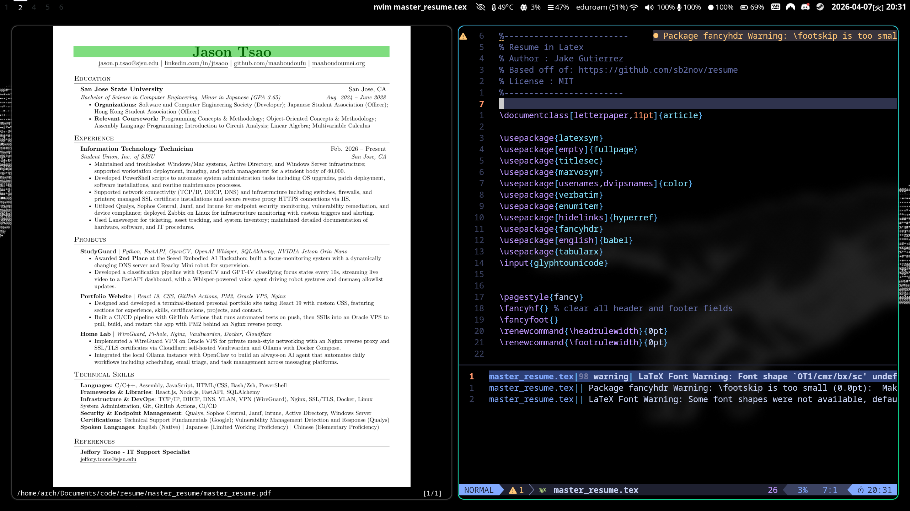

# Jason Tsao — Resume

A self-hosted LaTeX resume, free from platforms like Overleaf that lock you out after a year unless you pay. (inspired by @epicgdog)



---

## Why Self-Host?

Overleaf is great, but their free tier only lets you keep projects for so long before they pressure you to upgrade. Since a resume is something you'll maintain for years, it makes more sense to own it locally and version it with Git.

---

## Setup (Arch Linux)

### 1. Install a PDF Viewer

```bash
sudo pacman -S zathura-pdf-mupdf
```

Zathura is a lightweight, keyboard-driven PDF viewer. The `mupdf` backend gives it fast rendering. It also auto-reloads the PDF when the file changes on disk — you save the `.tex` file, LazyVim recompiles it, and Zathura updates immediately without any manual refresh.

### 2. Install TeX Live Packages

```bash
sudo pacman -S texlive-latex texlive-latexextra texlive-binextra texlive-fontsextra texlive-fontsrecommended
```

| Package | Why |
|---|---|
| `texlive-latex` | Core LaTeX engine and essential packages |
| `texlive-latexextra` | Extended packages (geometry, hyperref, enumitem, etc.) that most resumes need |
| `texlive-binextra` | Includes `latexmk`, used internally by vimtex to compile |
| `texlive-fontsextra` | Large collection of additional fonts |
| `texlive-fontsrecommended` | Commonly expected fonts — avoids missing font warnings |

### 3. Set Up LazyVim with LaTeX Support

This repo is edited in Neovim using [LazyVim](https://www.lazyvim.org/). If you don't have it set up yet:

```bash
# Back up your current Neovim config
mv ~/.config/nvim{,.bak}

# Optional but recommended
mv ~/.local/share/nvim{,.bak}
mv ~/.local/state/nvim{,.bak}
mv ~/.cache/nvim{,.bak}

# Clone the starter
git clone https://github.com/LazyVim/starter ~/.config/nvim

# Remove the starter's git history so you can manage it yourself
rm -rf ~/.config/nvim/.git

# Launch Neovim — it will bootstrap itself
nvim
```

**Enable the LaTeX extra:**

LazyVim has a built-in `lang.tex` extra that sets up everything needed to edit and compile LaTeX files — syntax highlighting, vimtex integration, and forward search with Zathura.

Open `~/.config/nvim/lua/config/lazy.lua` and add `lang.tex` to your extras:

```lua
require("lazy").setup({
  spec = {
    { "LazyVim/LazyVim", import = "lazyvim.plugins" },
    { import = "lazyvim.plugins.extras.lang.tex" }, -- add this line
    { import = "plugins" },
  },
})
```

Restart Neovim and run `:LazySync` to install the plugins.

---

## Workflow

1. Clone this repo
2. Install the dependencies above
3. Set up LazyVim with the `lang.tex` extra
4. Open `master_resume/master_resume.tex` in Neovim
5. Open the PDF in Zathura
6. Edit and save — Zathura reflects changes instantly

No internet required (unless your `.tex` file fetches remote packages on first compile).
